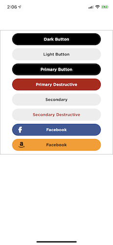

----

# Bose-UI
A collection of often-used UI elements such as buttons, etc. Hopefully will create a private cocoapod repo for this stuff. GothamSSm fonts are integrated into this project too. 

### Bose Buttons

#### enum Types:
- Dark
- Light
- Primary
- PrimaryDestructive
- Secondary
- SecondaryDestructive
- Facebook
- Amazon

### BoseARDirectionalMark
Added a BoseARDirectionalMark class which is a little circle with an arrow (supports up, down, left, right at the moment). Position a mark or marks where you'd like them on screen, and call wasLookedAt() or resetDetection() on each for UI feedback on whether the user is looking in such a direction or not. Discretion of the developer for that functionality.

### Screen Brightness / Theme Switching
There is currently a reading of screen brightness and a notification if it changes. If it changes while the application is active, it can be assumed to be a dynamic change based on the screen dimming while the user is in a dark environment. Thus we can dynamically change the theme based on this reading. 

Basic theme is now implemented but not system-wide yet.

### Theme Colors
I have added some theme colors which can be accessed like so:

```swift
let color = UIColor.FlatColor.Blue.Denim
```

Currently supported theme colors:

**Green**
- Fern
- MountainMeadow
- ChateauGreen
- PersianGreen

**Gray**
- AlmondFrost
- WhiteSmoke
- IronGray
- Iron
- Gainsboro
- Light Gray
- Silver
- Medium Gray
- Gray
- Dim Gray
- Slate Gray

**Blue**
- PictonBlue
- Mariner
- CuriousBlue
- Denim
- Chambray
- BlueWhale

**Violet**
- Wisteria
- BlueGem

**Yellow**
- Energy
- Turbo

**Orange**
- NeonCarrot
- Sun

**Red**
- TerraCotta
- Valencia
- Cinnabar
- WellRead
----

