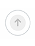
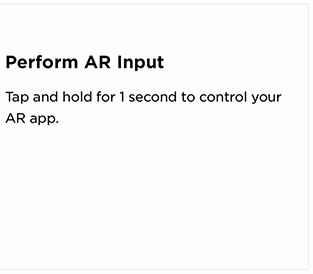

----

# Bose-UI
A collection of often-used UI elements such as buttons, etc. Hopefully will create a private cocoapod repo for this stuff. GothamSSm fonts are integrated into this project too. 

## Contents:
- [Bose Buttons](#bose-buttons)
- [BoseARDirectionalMark](#boseardirectionalmark)
- [CheckMarkDot](#checkmarkdot)
- [BoseInstructionalPanel](#boseinstructionPanel)
- [Screen Brightness / Theme Switching](#screen-brightness--theme-switching)
- [Theme Colors](#theme-colors)

----

### Bose Buttons

These buttons are typical of the Bose style - rounded ends with the simple colors. There are also two new types I hadn't seen before that I assume allow for logging into a Bose account with Facebook and also Amazon accounts. The touch produces a subtle shrinking animation and color changes within the class itself (handled for the developer). 

#### enum Types:
- Dark
- Light
- Primary
- PrimaryDestructive
- Secondary
- SecondaryDestructive
- Facebook
- Amazon

### BoseARDirectionalMark


Added a BoseARDirectionalMark class which is a little circle with an arrow (supports up, down, left, right at the moment). Position a mark or marks where you'd like them on screen, and call wasLookedAt() or resetDetection() on each for UI feedback on whether the user is looking in such a direction or not. Discretion of the developer for that functionality.

```swift
upDetectionDot = BoseARDirectionalMark(direction: .Up)
upDetectionDot.center = CGPoint(x: self.view.frame.width / 2, y: 70)
upDetectionDot.wasLookedAt()
```

### CheckMarkDot


Meant as a visual indicator that an operation was successful. It's essentially a circle with a checkmark inside it. You can adjust the background color, the checkmark color, and whether or not the circle gets a light gray border or not. Very simple.

```swift
// Customized.
let check1 = CheckMarkDot(backgroundColor: UIColor.FlatColor.Red.WellRead, 
                          useBorder: false,
                          checkmarkColor: UIColor.FlatColor.Red.TerraCotta)
// Uses defaults.
let check2 = CheckMarkDot()
```


### BoseInstructionPanel


When you need to ask the user for input, we have a panel that should display at the bottom of the screen when needed. Not theme-supported yet. Simple title and message.

```swift
boseInstruct = BoseInstructionPanel(width: amazonButton.frame.width + 20, 
                                    title: "Perform AR Input", 
                                    message: "Tap and hold for 1 second to control your AR app.")
boseInstruct.center = CGPoint(x: self.view.frame.midX, 
                              y: self.view.frame.height - (boseInstruct.frame.height / 2))
```

### Screen Brightness / Theme Switching
There is currently a reading of screen brightness and a notification if it changes. If it changes while the application is active, it can be assumed to be a dynamic change based on the screen dimming while the user is in a dark environment. Thus we can dynamically change the theme based on this reading. 

Basic theme is now implemented but not system-wide yet.

### Theme Colors
I have added some theme colors which can be accessed like so:

```swift
let color = UIColor.FlatColor.Blue.Denim
```

Currently supported theme colors:

| **Color**  |                |              |              |              |           |           |
|------------|----------------|--------------|--------------|--------------|-----------|-----------|
| **Green**  | MountainMeadow | ChateauGreen | PersianGreen | PersianGreen |           |           |
| **Gray**   | AlmondFrost    | WhiteSmoke   | IronGray     | Iron         | Gainsboro | LightGray |
|            | Silver         | MediumGray   | Gray         | DimGray      | SlateGray |           |
| **Blue**   | PictonBlue     | Mariner      | CuriousBlue  | Denim        | Chambray  | BlueWhale |
| **Violet** | Wisteria       | BlueGreen    |              |              |           |           |
| **Yellow** | Energy         | Turbo        |              |              |           |           |
| **Orange** | NeonCarrot     | Sun          |              |              |           |           |
| **Red**    | TerraCotta     | Valencia     | Cinnabar     | WellRead     |           |           |

----


